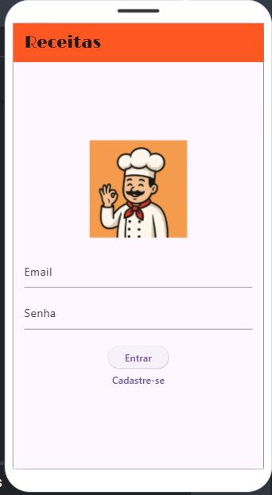
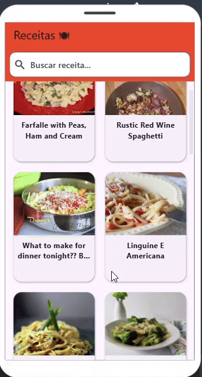

# Recipe App

## Descrição

O **Recipe App** é um aplicativo Flutter desenvolvido para gerenciar receitas e permitir que os usuários se cadastrem, façam login e visualizem receitas diretamente da API Spoonacular. Este projeto usa **Firebase Authentication** para gerenciar o login e cadastro dos usuários, além de integrar a busca por receitas da API.



---



## Funcionalidades

- **Autenticação de usuários** com Firebase (Cadastro/Login).
- **Busca de receitas** através da API Spoonacular.
- Exibição de receitas com **imagem, título e resumo**.
- **Interface intuitiva** com navegação fácil entre as telas.

## Tecnologias Utilizadas

- **Flutter**: Framework para desenvolvimento de aplicações móveis e web.
- **Firebase Authentication**: Sistema de autenticação para registro e login de usuários.
- **Spoonacular API**: API para buscar receitas e informações de ingredientes.
- **Google Fonts**: Biblioteca para fontes personalizadas na interface.

## Como Rodar o Projeto

1. Clone este repositório:
   ```bash
   git clone https://github.com/seu_usuario/recipe-app.git
Navegue até o diretório do projeto:

bash
Copiar
cd recipe-app
Instale as dependências:

bash
Copiar
flutter pub get
Configure o Firebase:

Crie um projeto no Firebase Console.

Adicione o Firebase ao seu projeto Flutter seguindo as instruções para Android e Web.

Baixe os arquivos de configuração do Firebase (google-services.json para Android e firebase_options.dart para Web) e coloque-os nas pastas corretas no seu projeto.

Execute o aplicativo:

bash
Copiar
flutter run
Estrutura do Projeto
bash
Copiar
/lib
    /firebase_options.dart       # Configurações do Firebase.
    /login_page.dart             # Página de Login do Usuário.
    /register_page.dart          # Página de Registro do Usuário.
    /recipes_page.dart           # Página para exibição de receitas.
    /main.dart                   # Inicialização do aplicativo.
    
/assets
    /images
        chef.png                 # Imagem do chef no login.
        chef2.png                # Imagem do chef no cadastro.
        
/pubspec.yaml                  # Dependências e configurações do Flutter.
Contribuição
Se você quiser contribuir com o projeto, siga os seguintes passos:

Faça um fork deste repositório.

Crie uma branch com suas alterações:

bash
Copiar
git checkout -b minha-branch
Faça as alterações e commit:

bash
Copiar
git commit -am 'Adiciona nova funcionalidade'
Envie suas alterações para o repositório remoto:

bash
Copiar
git push origin minha-branch
Abra um pull request.

Licença
Este projeto está licenciado sob a MIT License